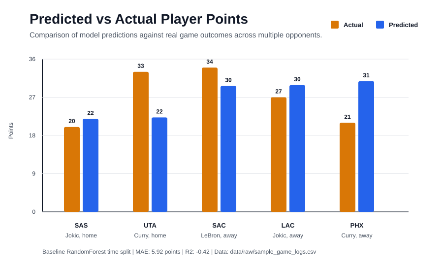

# Prop-Porter

Prop-Porter is an NBA player points prediction project that explores whether recent box-score history can be used to predict future scoring output.

## Demo



## What It Does

- Loads NBA player game logs
- Builds rolling historical features
- Trains a Random Forest model
- Predicts player point totals
- Evaluates predictions against actual results

## Run

Train and evaluate:

```bash
python -m src.train
```

Score sample rows:

```bash
python run_model.py --source auto --rows 2
```

Predict one player:

```bash
python predict_player.py --player "Stephen Curry" --source auto
```

## Features Used

- Recent points history
- Recent minutes
- Recent field goal attempts
- Home or away
- Rest days

## Limitations

This is an early exploration. It does not fully account for injuries, lineup changes, trades, coaching changes, or role changes, which are important for real sports prediction.

## Status

Prototype / exploration.

## Notes

This repo also contains earlier backend and frontend experiments. The main documented path is the ML pipeline and prediction demo above.
